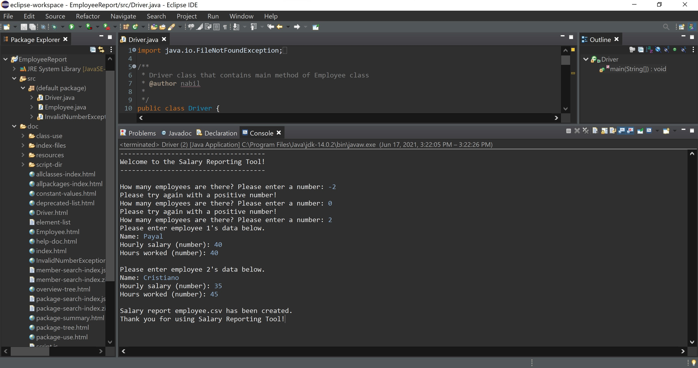

# Employee Reporting Tool - Java API

[](https://opensource.org/licenses/MIT)


A lightweight Java application for managing employee data and generating salary reports. The tool provides employee record management with data validation and CSV report generation capabilities.

## Table of Contents
- [Features](#features)
- [Requirements](#requirements)
- [Installation](#installation)
- [Usage](#usage)
- [Demo](#demo)
- [Architecture](#architecture)
- [API Documentation](#api-documentation)
- [Contributing](#contributing)
- [Testing](#testing)
- [License](#license)
- [Citation](#citation)
- [Acknowledgments](#acknowledgments)

## Features
- Employee record management with validation
- Custom exception handling for numerical inputs
- Automated CSV report generation
- Interactive command-line interface
- Data validation and sanitization
- Configurable salary calculation

## Requirements
- Java Development Kit (JDK) 8 or later
- Java Runtime Environment (JRE)
- Terminal or Command Prompt
- 256MB RAM minimum
- 10MB disk space

## Installation

### From Source
```bash
# Clone the repository
git clone https://github.com/nabilshadman/java-api-employee-reporting-tool.git

# Navigate to project directory
cd java-api-employee-reporting-tool

# Compile the project
javac EmployeeReport/src/*.java -d EmployeeReport/bin
```

## Usage

### Command Line Interface
```bash
# Run the application
java -cp EmployeeReport/bin Driver
```

### Sample Input/Output
```
How many employees are there? Please enter a number: 2

Please enter employee 1's data below.
Name: John
Hourly salary (number): 20.5
Hours worked (number): 40

Please enter employee 2's data below.
Name: Jane
Hourly salary (number): 25.0
Hours worked (number): 35
```

The application generates `salary_report_employee.csv` with the following format:
```csv
Employee Name,Salary,Hours,Weekly Pay
John,20.50,40,820.00
Jane,25.00,35,875.00
```

## Demo

Here's a visual demonstration of the application in action:

<table>
<tr>
  <td width="50%">
    <br/>
    <em>1. Interactive CLI collecting employee data</em>
  </td>
  <td width="50%">
    <br/>
    <em>2. Generated CSV salary report output</em>
  </td>
</tr>
</table>

The tool features:
- User-friendly command-line interface for data entry
- Input validation for numerical values
- Automated CSV report generation with formatted salary calculations


## Architecture
The project follows a modular architecture with three main components:
- `Employee.java`: Core data model and business logic
- `Driver.java`: Main application entry point and UI
- `InvalidNumberException.java`: Custom exception handling

## API Documentation
JavaDoc documentation is available in the `/EmployeeReport/doc` directory. Key classes:

```java
public class Employee {
    public Employee(String name, double hourlySalary, int hoursWorked)
    public static void printSalaryReport(ArrayList<Employee> employees)
}
```

## Contributing
1. Fork the repository
2. Create a feature branch (`git checkout -b feature/AmazingFeature`)
3. Commit changes (`git commit -m 'Add AmazingFeature'`)
4. Push to branch (`git push origin feature/AmazingFeature`)
5. Open a Pull Request


## Testing
```bash
# Run test suite
java -cp EmployeeReport/bin Test
```

## License
This project is licensed under the MIT License - see the [LICENSE](LICENSE.txt) file for details.

## Citation
If you use this project in your research, please cite it as:
```bibtex
@software{java-api-employee-reporting,
  author = {Shadman, Nabil},
  title = {Employee Reporting Tool - Java API},
  year = {2020},
  publisher = {GitHub},
  url = {https://github.com/nabilshadman/java-api-employee-reporting-tool}
}
```

## Acknowledgments
- OpenJDK community for Java development tools
- Contributors and maintainers

---
